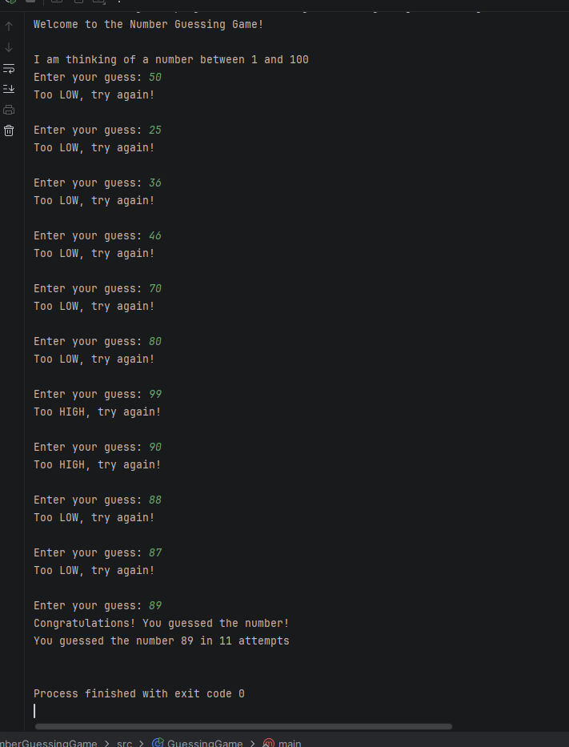
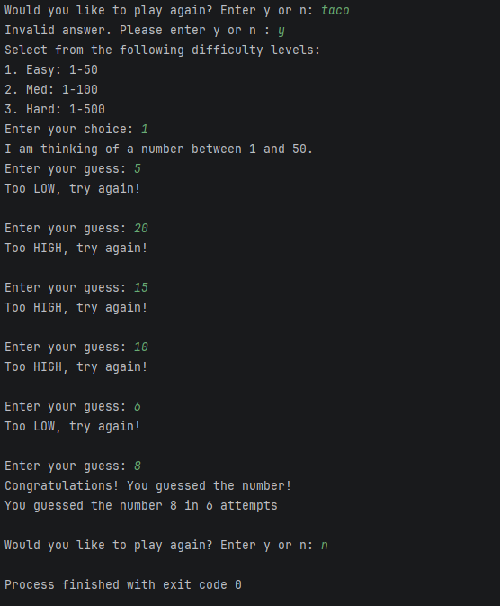
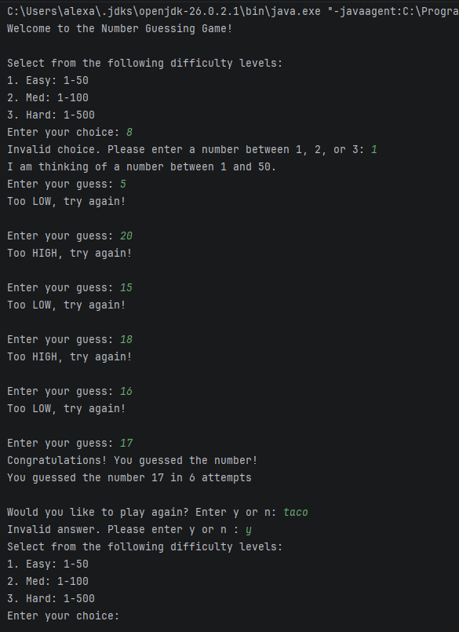

# Number Guessing Game

## Project Description
This number guessing game is a program written for a Java Course. Feedback is given after each guess (low/high) and number of attempts made.

## How to Run
1. Open project in IntelliJ.
2. Open `src/GuessingGame.java`.
3. Run `GuessingGame.java`.
4. Follow the prompts for the user in the console area to play the number guessing game.
5. Choose difficulty level.
6. Make guesses, and modify guesses depending on feedback (Too High/Too Low).
7. After playing, choose whether to play again (y/n).

## Screenshots
### Program Running

### Validation Testing

### Difficulty Selection and Play Again

### Invalid Guesses
